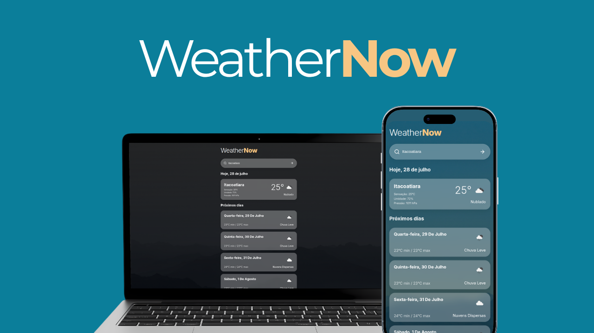

# WeatherNow ⛅

Um aplicativo moderno de previsão do tempo desenvolvido em React, que permite consultar informações climáticas em tempo real de qualquer cidade do mundo. A aplicação oferece uma interface intuitiva, responsiva e adaptável ao período do dia, proporcionando uma experiência agradável em qualquer dispositivo.

---

## Imagem do Projeto



---

## Sobre o Projeto

O **WeatherNow** é uma aplicação web que consome a API da OpenWeatherMap para fornecer informações meteorológicas atualizadas de cidades ao redor do mundo.

O projeto foi desenvolvido utilizando boas práticas de desenvolvimento front-end, componentização, consumo de APIs REST e estilização moderna com SCSS, priorizando desempenho, organização do código e experiência do usuário.

---

## Funcionalidades

- 🔍 **Busca de cidades** — Pesquise por qualquer cidade do mundo.
- 🌡️ **Clima atual** — Exibe temperatura, sensação térmica, umidade, pressão atmosférica e descrição do clima.
- 📅 **Previsão para os próximos 5 dias** — Visualização organizada em cards responsivos.
- 🌤️ **Ícones dinâmicos** — Ícones oficiais fornecidos pela OpenWeatherMap.
- 🌓 **Tema automático** — O sistema alterna automaticamente entre **Modo Claro** durante o dia e **Modo Escuro** durante a noite, proporcionando maior conforto visual.
- 📱 **Design Responsivo** — Interface adaptada para smartphones, tablets e desktops.

---

## Tecnologias Utilizadas

| Categoria | Tecnologia | Versão |
|-----------|------------|--------|
| **Frontend** | React | 19.2.5 |
| **Build Tool** | Vite | 8.0.10 |
| **HTTP Client** | Axios | 1.15.2 |
| **Estilização** | SCSS (Sass) | 1.99.0 |

---

## APIs Utilizadas

### OpenWeatherMap

Responsável por fornecer todos os dados meteorológicos utilizados na aplicação.

- **Current Weather API** — Clima atual.
- **5 Day / 3 Hour Forecast API** — Previsão para os próximos dias.

https://openweathermap.org/api

---

## Instalação

### Pré-requisitos

- Node.js 16 ou superior
- npm ou yarn

### Clone o repositório

```bash
git clone https://github.com/xavierrjon/weather-now-web.git
```

### Acesse a pasta

```bash
cd WeatherNow
```

### Instale as dependências

```bash
npm install
```

### Execute o projeto

```bash
npm run dev
```

A aplicação estará disponível em:

```
http://localhost:5173
```

---


## Destaques do Projeto

- Arquitetura baseada em componentes reutilizáveis.
- Consumo de APIs REST utilizando Axios.
- Interface moderna construída com SCSS.
- Layout totalmente responsivo.
- Tema adaptável ao horário do dia.
- Código organizado e de fácil manutenção.

---

## Licença

Este projeto está disponível sob a licença **MIT**.